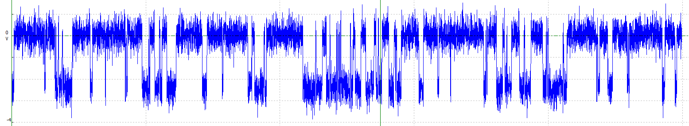

# Deep-Channel

This repository contains code for the paper, [Deep-Channel: A Deep Convolution and Recurrent Neural Network for Detection of Single Molecule Events] (https://www.biorxiv.org/content/10.1101/767418v3), by Numan Celik, Fiona O'Brien, Yalin Zheng, Frans Conens, and Richard Barrett-Jolley.

This code contains the implementation of a deep learning method to automatically identify transition events of raw time-series ion channel data files. This deep learning method for the analysis of patch-clamp electrophysiological data, relies on convolutional neural networks (CNN) and long short-term memory (LSTM) architecture. This network automatically idealises complex single molecule activity more accurately and faster than traditional threshold crossing or segmental K-means (SKM). 

## Dependencies
* Python 3.5 and higher
* Keras framework with Tensorflow backend
* Numpy, pandas, matplotlib libs
* Scikitlearn framework

## Steps (How to run)
1. Download the dataset:
    * Download via Github:
     The raw ion channel data files can be downloaded from this repository in the folder "training dataset"
    * Download via Kaggle:
     The raw ion channel data files (.csv) with idealized records can be downloaded from kaggle.com/

2. Activate conda environment:

    * Run `conda env create -f environment.yml && conda activate DeepChannel` to install dependencies and activate virtual environment. 

3. Run:
   * Run the file *deepchannel_train.py* to train the Deep-channel model based on LSTM-convolution layers using the training set and evaluates the model on a different test set.
   
   * Once training procedure has been completed, run the file *predictor.py* to predict automatically given a different dataset. 

   * Check the trained model with other benchmark modalities. To do this run the file *predict_deepchannel_QuB* and this will compare the Deep-channel model performances with other benchmark (QuB, thresold) modalities.
   
   * A pre-trained model has been saved in model folder called *nmn_oversampled_deepchanel2_5.h5* and this file can be run through *predictor.py* file to test the idalized record through Deep-channel model without training.
   
## Synthetic data creation
A large collections of synthetic one channel and/or multi-channel raw ion channel data files have been created through a Signal software script called *synthetic_data.sgs*. 
These large collections of data files are used for training the Deep-channel model. 

A sample of synthetic ion channel data created through Signal script:

## Citation / DOI
Please cite this work through this DOI link:
https://doi.org/10.1101/767418
